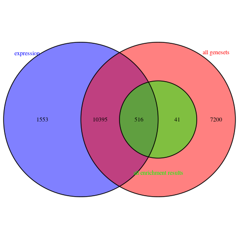

# 0. Load all needed packages:
```{r library_loading, message=FALSE, warning=FALSE, results='hide'}
if (!require("BiocManager", quietly = TRUE))
  install.packages("BiocManager")

if (!requireNamespace("GEOmetadb", quietly = TRUE)){
  BiocManager::install("GEOmetadb")
}
if (!require("knitr", quietly = TRUE))
  install.packages("knitr")

if (! requireNamespace("edgeR", quietly = TRUE)) {
    BiocManager::install("edgeR")
}

if (!requireNamespace("ComplexHeatmap", quietly = TRUE)){
  BiocManager::install("ComplexHeatmap")
}
if (!require("kableExtra", quietly = TRUE))
  install.packages("kableExtra")
if (! requireNamespace("RCurl", quietly = TRUE)) {
  BiocManager::install("RCurl")
}
if (!require("circlize", quietly = TRUE))
  install.packages("circlize")
if (!require("GSA", quietly = TRUE))
  install.packages("GSA")
if (!require("VennDiagram")) {
  install.packages("VennDiagram")
}

library(GEOmetadb)
library(knitr)
library(edgeR)
library(ComplexHeatmap) 
library(circlize)
library(kableExtra)
library(RCurl)
library(GSA)
library(VennDiagram)
```


# 1. Brief Introduction of Assignment 1 Results

### 1.1 Loading the chosen dataset

* The choice of dataset is _GSE85995_, the data file was download by using GEOmetadb package method. 

* In assignment 1, clean process was performed to remove **duplicated**, **non-informative** and **weakly express** data. Mapping process was performed by mappping row identifiers into the most updated HGNC symbols. The cleaned and mapped data was saved into _gata3_cleaned_mapped_data.rds_ file. More detail code algorithm was presented in _A1.Rmd_ file.
```{r A1_summary_download, message=FALSE, warning=FALSE, results='hide'}
sfiles = getGEOSuppFiles('GSE85995')

# <clean and map, the detailed code are in "A1.Rmd"> ...

if (!file.exists("gata3_cleaned_mapped_data.rds")) {
  options(knitr.duplicate.label = 'allow')
  source(purl("A1.Rmd", output = tempfile()))
}
gata3_cleaned_maped_data <- readRDS("gata3_cleaned_mapped_data.rds")
```
<br>

### 1.2 Normalization and clean

* **TMM** normalization was performed in assignment 1. 
```{r A1_summary_norm, message=FALSE, warning=FALSE}
filtered_data_matrix <- as.matrix(gata3_cleaned_maped_data[,3:ncol(gata3_cleaned_maped_data)])
rownames(filtered_data_matrix) <- gata3_cleaned_maped_data$hgnc_symbols
group = c(rep("scrambled siRNA",3),rep("GATA3 siRNA",3))
d = DGEList(counts=filtered_data_matrix, group = group)
d = calcNormFactors(d)
normalized_cleaned_gata3 <- cpm(d)
```


* Density plots were compared for the cleaned and mapped data before and after normalization. The data before normalization followed a normal distribution. After normalization, the pattern remained and the edges of the data were cleaned up slightly.
```{r A1_summary_plots, message=FALSE, warning=FALSE, out.width=c('50%', '50%'), fig.show='hold', fig.cap="Figure 1: GATA3 RNASeq Samples Density Plots Comparison by using TMM Normalization.", fig.align='center'}
# before
data2plot <- log2(cpm(gata3_cleaned_maped_data[,3:ncol(gata3_cleaned_maped_data)]))
counts_density <- apply(data2plot, 2, density)
xlim <- 0; ylim <- 0
for (i in 1:length(counts_density)) {
  xlim <- range(c(xlim, counts_density[[i]]$x)); 
  ylim <- range(c(ylim, counts_density[[i]]$y))
}
cols <- rainbow(length(counts_density))
ltys <- rep(1, length(counts_density))
plot(counts_density[[1]], xlim=xlim, ylim=ylim, type="n", 
     ylab="Smoothing density of log2-CPM", 
     main = "Figure 1.1: Pre-normalization Density Plot",
     cex.lab = 0.85)
for (i in 1:length(counts_density)) lines(counts_density[[i]], col=cols[i], lty=ltys[i])
legend("topright", colnames(data2plot),  
       col=cols, lty=ltys, cex=0.75, 
       border ="blue",  text.col = "green4", 
       merge = TRUE, bg = "gray90")

# after
normalized_data2plot <- log2(normalized_cleaned_gata3)
normalized_counts_density <- apply(normalized_data2plot, 2, density)
xlim <- 0; ylim <- 0
for (i in 1:length(normalized_counts_density)) {
  xlim <- range(c(xlim, normalized_counts_density[[i]]$x)); 
  ylim <- range(c(ylim, normalized_counts_density[[i]]$y))
}
cols <- rainbow(length(normalized_counts_density))
ltys <- rep(1, length(normalized_counts_density))
plot(normalized_counts_density[[1]], xlim=xlim, ylim=ylim, type="n",      
     ylab="Smoothing density of log2-CPM", 
     main = "Figure 1.2: Post-normalization Density Plot",
     cex.lab = 0.85)
for (i in 1:length(normalized_counts_density)) lines(normalized_counts_density[[i]], col=cols[i], lty=ltys[i])
legend("topright", colnames(normalized_data2plot), 
       col=cols, lty=ltys, cex=0.75, 
       border ="blue",  text.col = "green4", 
       merge = TRUE, bg = "gray90")
```


* The normalized data was saved into _gata3_cleaned_normalized.rds_ file.
```{r A1_summary_save, message=FALSE, warning=FALSE, results='hide'}
if (!file.exists("gata3_cleaned_normalized.rds")) {
  saveRDS(normalized_cleaned_gata3, "gata3_cleaned_normalized.rds")
}
```


---

# 2. Brief Introduction of Assignment 2 Results

### 2.1 Differential Gene Expression:

* The normalized data was initially visualized by using a heatmap and MDS plot to select the proper model for the differential gene expression task. C represents the control condition and G represents the testing condition. The initial heat map has roughly clustering by cell type, but the pattern of genes division is not very apparent. In the MDS plots, the cell type model demonstrated a closer distance within the same group than the patient type model. Then, the construction of simple and complex models was designed based on cell type. 
```{r data_loading, message=FALSE, warning=FALSE, echo=FALSE,fig.align='center', fig.dim=c(6,4), fig.cap="Figure 2: Initial heat map for the normalized GATA3 data"}
if (!file.exists("gata3_cleaned_normalized.rds")) {
  options(knitr.duplicate.label = 'allow')
  source(purl("A1.Rmd", output = tempfile()))
}
gata3_data <- readRDS("gata3_cleaned_normalized.rds")
gata3_samples<-data.frame(lapply(colnames(gata3_data), 
                                 FUN=function(x){unlist(strsplit(x, split = "-")[[1]][1])}))
gata3_samples<-data.frame(lapply(gata3_samples[1,], 
                                 FUN=function(x){unlist(strsplit(x, split = ""))}))
colnames(gata3_samples) <- data.frame(lapply(colnames(gata3_data), 
                                 FUN=function(x){unlist(strsplit(x, split = "-")[[1]][1])}))
rownames(gata3_samples) <- c("cell_type","sample_type")
gata3_samples <- data.frame(t(gata3_samples))
colnames(gata3_data) <- rownames(gata3_samples)
heatmap_matrix <- t(scale(t(gata3_data)))

if(min(heatmap_matrix) == 0){
  heatmap_col = colorRamp2(c( 0, max(heatmap_matrix)),
                           c( "white", "red"))
} else {
  heatmap_col = colorRamp2(c(min(heatmap_matrix), 0, max(heatmap_matrix)), 
                           c("blue", "white", "red"))
}
current_heatmap <- Heatmap((heatmap_matrix),
                           show_row_dend = TRUE,show_column_dend = TRUE,
                           col=heatmap_col,show_column_names = TRUE,
                           show_row_names = FALSE,show_heatmap_legend = TRUE, 
                           column_title = "Samples", 
                           row_title = "Genes",
                           name = "normalized")

```

```{r A2_MDS_plot, message=FALSE, warning=FALSE, out.width=c('50%', '50%'),fig.align='center',fig.show='hold', fig.cap="Figure 3: GATA3 RNASeq Samples MDS Plots Comparison by using Two Models", echo=FALSE}
# MDS plot, by cell type (in A1)
plotMDS(heatmap_matrix, 
        col = c("darkgreen", "blue")[factor(gata3_samples$cell_type)],
        main = "Figure 3.1: Cell Type Model ")
legend("topright", 
       legend=c("C: scrambled siRNA", "G: GATA3 siRNA"),
       fill = c("darkgreen", "blue"),
       cex=0.7)

# MDS plot by sample cluster
pat_colors <- unlist(rainbow(3))[factor(gata3_samples$sample_type)]
plotMDS(heatmap_matrix, 
        col = pat_colors,
        main = "Figure 3.2: Patient Model")
legend("topright", 
       legend=c("Sample 1", "Sample 2", "Sample3"),
       fill = pat_colors,
       cex=0.7)
```
<br>

  * Two models were designed: simple (cell type only) and complex (cell type and patient variation). The lmFit() method in the limma package was applied to perform the Benjamini-Hochberg FDR multiple hypothesis testing at the threshold of 0.05. The threshold value is also the same value used in the original paper. 

  * According to the results in Figure 4, the gene of interest was selected in both models with close to 0 p-values. The majority of genes stood not significant. For the differential expressed gene (DEG) from both models, the p-values are fundamentally below the threshold of 0.05. 

```{r A2_build_models, message=FALSE, warning=FALSE, results='hide', echo=FALSE}
# cell type variation model
cell_type_model <- model.matrix(~ gata3_samples$cell_type)
kable(cell_type_model, type="html")
expressionMatrix <- as.matrix(gata3_data)
rownames(expressionMatrix) <- rownames(gata3_data)
colnames(expressionMatrix) <- colnames(gata3_data)
minimalSet <- ExpressionSet(assayData=expressionMatrix)
fit <- lmFit(minimalSet, cell_type_model)
fit2 <- eBayes(fit,trend=TRUE)
topfit <- topTable(fit2,
                   coef=ncol(cell_type_model),
                   adjust.method = "BH",
                   number = nrow(expressionMatrix))
output_hits <- merge(rownames(gata3_data),
                     topfit,
                     by.y=0,by.x=1,
                     all.y=TRUE)
colnames(output_hits)[1] <- "hgnc_symbol"
output_hits <- output_hits[order(output_hits$P.Value),]

patient_model <- model.matrix(~ gata3_samples$sample_type + 
                                gata3_samples$cell_type)
kable(patient_model,type="html")
fit_patient <- lmFit(minimalSet, patient_model)
fit_patient2 <- eBayes(fit_patient,trend=TRUE)
topfit_pat <- topTable(fit_patient2,
                   coef=ncol(patient_model),
                   adjust.method = "BH",
                   number = nrow(expressionMatrix))
output_sample_type_hits <- merge(rownames(gata3_data),
                                 topfit_pat,
                                 by.y=0,by.x=1,
                                 all.y=TRUE)
colnames(output_sample_type_hits)[1] <- "hgnc_symbol"
output_sample_type_hits <- output_sample_type_hits[order(output_sample_type_hits$P.Value),]
cell_model_pvalues <- data.frame(hgnc_symbol = output_hits$hgnc_symbol,
                                 cell_pvalue=output_hits$P.Value)
patient_model_pvalues <-  data.frame(hgnc_symbol = output_sample_type_hits$hgnc_symbol,
                                    sample_pvalue = output_sample_type_hits$P.Value)
two_models_pvalues <- merge(cell_model_pvalues,
                            patient_model_pvalues,by.x=1,by.y=1)
two_models_pvalues$colour <- "grey"
#cell type model significant in orange
two_models_pvalues$colour[two_models_pvalues$cell_pvalue<0.05] <- "orange"
#sample type model significant in blue
two_models_pvalues$colour[two_models_pvalues$sample_pvalue<0.05] <- "blue"
#both models are significant in red
two_models_pvalues$colour[two_models_pvalues$cell_pvalue<0.05 & 
                            two_models_pvalues$sample_pvalue<0.05] <- "red"
```

```{r model_plot, warning=FALSE, message=FALSE, echo=FALSE, fig.align='center'}
par(mar=c(5,5,5,6))
plot(two_models_pvalues$cell_pvalue,
     two_models_pvalues$sample_pvalue,
     col = two_models_pvalues$colour,
     xlab = "Simple model p-values",
     ylab ="Patient model p-values",
     main="Figure 4: Simple model vs Complex model Limma")
points(two_models_pvalues[which(two_models_pvalues$hgnc_symbol == "GATA3"),2:3],
       pch=24, col="purple", cex=1.5)
legend("topright", inset=c(-0.25,0),bty = "n", xpd=TRUE,
       legend=c("cell type model", "patient model", "both", "GATA3","not signif"),
       fill = c("orange", "blue","red", "purple" ,"grey"),
       cex=0.7)
```
<br>

* The complex model was used for the edgeR QLF test additionally. Similar to the result from limma, the edge results also have a large portion of non-significant genes as the grey region in Figure 5. But the amount of differentially expressed genes selected by the edgeR method was less than that of limma. GATA3 was also selected by the edgeR method with an expected low p-value. 

* To quantitatively summarize the results from both methods:

  + In the limma method, there were 6378 DEGs with the threshold of 0.05, which is 51.17% of genes in the cleaned and mapped data.

  + In the edgeR method, there were 1419 DEGs with the threshold of 0.05, which is 11.38% of genes in the cleaned and mapped data.
  
  + After the p-value correction by the Benjamini-Hochberg method, 5311 genes passed in the limma method, which has the 42.61% of the selected differentially expressed genes. From the chosen model in the edgeR method, 452 genes passed the correction. The percentage was 3.63%.
  
```{r A2_edgeR1, warning=FALSE, message=FALSE, fig.align='center'}
# by cell type model
expressionMatrix <- as.matrix(gata3_data)
d = DGEList(counts=expressionMatrix, group=gata3_samples$cell_type)
d <- estimateDisp(d, patient_model)
fit <- glmQLFit(d, patient_model)
qlf.pos_vs_neg <- glmQLFTest(fit)
qlf_output_hits <- topTags(qlf.pos_vs_neg,sort.by = "PValue",
                           n = nrow(gata3_data))
par(mar=c(5,5,5,6))
qlf_model_pvalues <- data.frame(hgnc_symbol = rownames(qlf_output_hits$table),
                                     qlf_pvalue=qlf_output_hits$table$PValue)
limma_model_pvalues <-  data.frame(hgnc_symbol = output_hits$hgnc_symbol,
                                        limma_pvalue = output_hits$P.Value)
two_models_pvalues <- merge(qlf_model_pvalues,
                            limma_model_pvalues,
                            by.x=1,by.y=1)
two_models_pvalues$colour <- "grey"
two_models_pvalues$colour[two_models_pvalues$qlf_pvalue<0.05] <- "orange"
two_models_pvalues$colour[two_models_pvalues$limma_pvalue<0.05] <- "blue"
two_models_pvalues$colour[two_models_pvalues$qlf_pvalue<0.05 &
                            two_models_pvalues$limma_pvalue<0.05] <- "red"
plot(two_models_pvalues$qlf_pvalue,
     two_models_pvalues$limma_pvalue,
     col = two_models_pvalues$colour,
     xlab = "QLF p-values",
     ylab ="Limma p-values",
     main="Figure 5: QLF vs Limma with DEGs from the Complex Model of GATA3 RNASeq Samples",
     cex.main = 0.85)

points(two_models_pvalues[which(two_models_pvalues$hgnc_symbol == "GATA3"),2:3],
       pch=24, col="purple", cex=1.5)
legend("topright", inset=c(-0.25,0),bty = "n", xpd=TRUE,
       legend=c("qlf only", "limma only", "both", 
                "GATA3", "not signif"),
       fill = c("orange", "blue","red", "purple", "grey"),
       cex=0.7)
```
<br>

* Eventually, due to the design target of the edgeR method algorithm being more conforming to the sample type, the edgeR method generated results were used to perform the later tasks.

<br>

* The volcano plot in Figure 6 displays the division of up-regulated and down-regulated genes from the edgeR result. A clear separation for up-regulated and down-regulated genes occurred based on the logFC.
```{r A2_volcano_plot, message=FALSE, warning=FALSE, echo=FALSE, fig.show='hold',  fig.align='center'}
df_edger <- data.frame(logFC = qlf_output_hits$table$logFC, 
                 neg_logFDR = -log10(qlf_output_hits$table$FDR),
                 FDR = qlf_output_hits$table$FDR,
                 color="grey")
df_edger$color[which(df_edger$logFC > 0 & df_edger$FDR < 0.05)] <- "green"
df_edger$color[which(df_edger$logFC< 0 & df_edger$FDR < 0.05)] <- "purple"
plot(df_edger[,1:2], 
     col=df_edger$color, 
     main = "Figure 6: Volcano Plots Comparison by using edgeR Method")
legend("topright", 
       legend=c("up-regulated", "down-regulated", "neither"), 
       fill = c("purple","green", "grey"),
       cex = 0.7)
```
<br>

* The top hits from the edgeR results were used to generate the heat map in Figure 7. The graph presents clustering based on cell type. The clustered patterning is more clear compared to the initial heatmap.
```{r A2_sample_heatmap, message=FALSE, warning=FALSE, echo=FALSE, fig.align='center',fig.cap="Figure 7: Normalized GATA3 RNASeq Samples Heat Maps by using Complex Model in edgeR", , fig.show='hold'}


```
<br>

### 2.2 Thresholded over-representation analysis


* The results of the DEGs list were saved as three txt files: up-regulated genes list, down-regulated genes list and all ranked genes list. The method to distinguish between up-regulated and down-regulated genes is based on FDR values. 
```{r A2_gene_list, message=FALSE, warning=FALSE}
qlf_output_hits_withgn <- merge(rownames(gata3_data),qlf_output_hits, by.x=1, by.y = 0)
colnames(qlf_output_hits_withgn)[1] <- "hgnc_symbol"
qlf_output_hits_withgn[,"rank"] <- -log(qlf_output_hits_withgn$PValue,base =10) * 
                                        sign(qlf_output_hits_withgn$logFC)
qlf_output_hits_withgn <- qlf_output_hits_withgn[order(qlf_output_hits_withgn$rank),]
up_regulated <- qlf_output_hits_withgn$hgnc_symbol[which(qlf_output_hits_withgn$PValue < 0.05
                                                   & qlf_output_hits_withgn$logFC > 0)]
down_regulated <- qlf_output_hits_withgn$hgnc_symbol[which(qlf_output_hits_withgn$PValue < 0.05
                                                     & qlf_output_hits_withgn$logFC < 0)]
if(!file.exists("gata3_upregulated_genes.txt")){
  write.table(x=up_regulated,
            file=file.path("data","gata3_upregulated_genes.txt"),sep = "\t",
            row.names = FALSE,col.names = FALSE,quote = FALSE)
}

if(!file.exists("gata3_downregulated_genes.txt")){
  write.table(x=down_regulated,
            file=file.path("data","gata3_downregulated_genes.txt"),sep = "\t",
            row.names = FALSE,col.names = FALSE,quote = FALSE)
}
if(!file.exists("gata3_ranked_genelist.txt")){
  write.table(x=data.frame(genename= qlf_output_hits_withgn$hgnc_symbol,
                         F_stat=qlf_output_hits_withgn$rank),
            file=file.path("data","gata3_ranked_genelist.txt"),sep = "\t",
            row.names = FALSE,col.names = FALSE,quote = FALSE)
}
```
<br>

* g:profiler [@raudvere_kolberg_kuzmin_arak_adler_peterson_vilo_2019] was used for performing the threshold analysis for the up-regulated and down-regulated genes lists. The annotation sources used were *GO biological process*, *Reactome* and *WikiPathways*. The threshold was 0.05 in Benjamini-Hochberg FDR. The retrieved results are:


```{r go_profiler_up, results='asis', echo=FALSE, out.width="100%"}
data_resource = c("Go: BP", "REAC", "WP")
top_terms = c("regulation of chromosome organization", 
              "Mitotic Prometaphase", 
              "Retinoblastoma gene in cancer")
t = c(192,199,88)
q = c(834,566,466)
t_intersect_q = c(30, 35, 32)
df_up = data.frame(data_resource, top_terms, t, q, t_intersect_q)
colnames(df_up) = c("Resource", "Top Term", "$T$", "$Q$", "$T \\cap Q$")
kable(df_up, format = 'html', caption = "Table 1.1: The up-regulated genes list result", escape=FALSE,align=c(rep('c',times=5)))%>%
  kable_styling(full_width = F)
```
<br>

```{r go_profiler_down, results='asis', echo=FALSE,out.width="100%"}
data_resource = c("Go: BP", "REAC", "WP")
top_terms = c("ribosomal large subunit biogenesis", 
              "rRNA processing in the nucleus and cytosol", 
              "Metabolic reprogramming in colon cancer")
t = c(72,192,44)
q = c(527,399,341)
t_intersect_q = c(18, 40, 16)
df_down = data.frame(data_resource, top_terms, t, q, t_intersect_q)
colnames(df_down) = c("Resource", "Top Term", "$T$", "$Q$", "$T \\cap Q$")
kable(df_down, format = 'html', caption = "Table 1.2: The down-regulated genes list result", escape=FALSE,align=c(rep('c',times=5)))%>%
  kable_styling(full_width = F)
```
<br>

```{r go_profiler_all, results='asis', echo=FALSE,out.width="100%"}
data_resource = c("Go: BP", "REAC", "WP")
top_terms = c("regulation of chromosome organization", 
              "rRNA processing in the nucleus and cytosol", 
              "Retinoblastoma gene in cancer")
t = c(192,192,88)
q = c(1361,965,787)
t_intersect_q = c(41, 47, 36)
df_all = data.frame(data_resource, top_terms, t, q, t_intersect_q)
colnames(df_all) = c("Resource", "Top Term", "$T$", "$Q$", "$T \\cap Q$")
kable(df_all, format = 'html', caption = "Table 1.3: All DEG genes list result", escape=FALSE,align=c(rep('c',times=5)))%>%
  kable_styling(full_width = F)
```
<br>

* Full list of the query results:

  + [up-regulated](data/gProfiler_hsapiens_2022-04-02_22-10-37_up.png)
  + [down-regulated](data/gProfiler_hsapiens_2022-04-02_22-14-03_down.png)
  + [all](data/gProfiler_hsapiens_2022-04-02_22-17-22_all.png)
<br>

---

# 3. Non-thresholded Gene set Enrichment Analysis

### 3.1 GSEA input files and parameters

* The ranked list saved in the assignment 2 was used as rank list input in non-threshold gene sets enrichment analysis. 

* Firstly, I converted the ranked txt file into an rnk file as valid GSEA input. 

```{r convert_file, warning=FALSE, results='hide', message=FALSE}
txt_file <- read.delim("data/gata3_ranked_genelist.txt", header = FALSE)
write.table(x=txt_file, file=file.path("data","gata3_ranked_genelist.rnk"),sep = "\t", 
            row.names = FALSE,col.names = c('GeneName','rank'),quote = FALSE)


```

* The gene database used was **Human_GOBP_AllPathways_no_GO_iea_March_01_2022_symbol.gmt** from the Bader lab [@merico_isserlin_stueker_emili_bader_2010], which is the latest version of human symbol in the resources.
```{r geturl, message=FALSE, warning=FALSE, results='hide'}
# go to the current_release for finding the latest genesets for human
gmt_url = "http://download.baderlab.org/EM_Genesets/current_release/Human/symbol/"
filenames = getURL(gmt_url)
tc = textConnection(filenames)
contents = readLines(tc)
close(tc)
rx = gregexpr("(?<=<a href=\")(.*.GOBP_AllPathways_no_GO_iea.*.)(.gmt)(?=\">)",
              contents, perl = TRUE)
gmt_file = unlist(regmatches(contents, rx))
dest <- file.path(paste(getwd(),'data', sep="/"),gmt_file)
download.file(paste(gmt_url,gmt_file,sep=""), destfile=dest)
```


* The parameters used are: 

  * Collapse = No_Collapse
  * max gene set size = 200
  * min gene set size = 15

* The GSEA was performed externally by using the above files and configurations in the GSEA software.

* The initial html of the GSEA results: [index.html](data/gsea_results/index.html)
* The screenshots of top 10 hits genesetsL [na_pos](data/gsea_results/gsea_na_pos_top10.png) [na_neg](data/gsea_results/gsea_na_neg_top10.png)
<br>

### 3.2 Short Summary of the Results:

#### 1. What method did you use? What genesets did you use? Make sure to specify versions and cite your methods.

* I used GSEA Preranked method in GSEA **4.2.3** software. 

* The geneset database used was the latest version of the human symbol from the Bader lab gene sets collections  (**Human_GOBP_AllPathways_no_GO_iea_March_01_2022_symbol.gmt**) [@isserlin_2016]. The query used the getURL() method in the _RCurl_ package to obtain the file [@RCurl_package]. Applied the regex expression to find the latest updated file including GO biological pathway dataset and download it into the data folder for use.

* The parameter for setting GSEA Preranked task was listed on above.

#### 2. Summarize your enrichment results.

* The reason for regulating the geneset size range from 200 to 15 is to obtain more specific meaningful pathways and avoid extreme values affecting the results. The choice of not collapse is due to the uniqueness of all gene symbols in the ranked list file. In the results generated by assignment 1, all hgnc symbols saved in the normalized data were verified to be unique. This setting is also the recommended parameter setting for a ranked gene list with unique human gene symbols in the user guide of GSEA [@subramanian_tamayo_mootha_mukherjee_ebert_gillette_paulovich_pomeroy_golub_lander_et_al._2005].


* The top genesets returned summarized table is:
```{r gsea_result, results='asis', echo=FALSE}
terms = c("Type","Top geneset","Size", "P-value", "ES", "NES", "FDR","Top gene")
type = c("na_pos", "na_neg")
top = c("CYTOSKELETON-DEPENDENT CYTOKINESIS%GOBP%GO:0061640","VALIDATED TARGETS OF C-MYC TRANSCRIPTIONAL ACTIVATION%PATHWAY INTERACTION DATABASE NCI-NATURE CURATED DATA%VALIDATED TARGETS OF C-MYC TRANSCRIPTIONAL ACTIVATION")
num =c(88,75)
p = c(0.000, 0.000)
es = c(0.69, -0.79)
nes = c(2.03, -2.24)
fdr = c(0.014, 0.000)
top_gene = c("STMN1", "UBTF")
df_all = data.frame(type, top, num, p, es, nes, fdr, top_gene)
kable(df_all, format = 'html', caption="Table 2: The top gene sets in GSEA results", col.names = terms, escape=FALSE, align="cccccccc")%>%
  kable_styling(full_width = F) %>% column_spec(column = 2, width = "40%")
```

#### 3. How do these results compare to the results from the thresholded analysis in Assignment 2. Compare qualitatively. Is this a straight forward comparison? Why or why not?

  * Compared with the assignment 2 results, the top genesets returned in the enrichment analysis were not identical. For the up-regulated genes, the second-ranked geneset (MITOTIC PROMETAPHASE%REACTOME DATABASE ID RELEASE 79%68877) was the top geneset in the assignment 2 Reactome result. The top geneset generated from the GSEA result was the 12th of GO:BP results in assignment 2. Similar to the down-regulated genes, the third GSEA ranked geneset (rRNA PROCESSING IN THE NUCLEUS AND CYTOSOL%REACTOME%R-HSA-8868773.3) was the top hit in the assignment 2 Reactome result. 
    
  * This comparison is straightforward. The ranked gene content imported in the enrichment analysis is the same as the normalized data but additionally assigned with ranking scores. The annotation source of GO: BP is also commonly applied in both analyses. Also in the parameter settings, I used the same range of 15 to 200 to limit the genome size in both threshold and non-threshold analyses. However, the top hit genesets are relevant but not identical.
<br>

---

# 4. Visualize your Gene set Enrichment Analysis in Cytoscape

### 4.1 Create an enrichment map

The enrichment map was created externally using Cytoscape software [@shannon_markiel_ozier_baliga_wang_ramage_amin_schwikowski_ideker_2003] and EnrichmentMap Cytoscape App [@merico_isserlin_stueker_emili_bader_2010]. The network visualization pictures were saved into the data folder.

#### How many nodes and how many edges in the resulting map? What thresholds were used to create this map? Make sure to record all thresholds. Include a screenshot of your network prior to manual layout.

* Cytoscape **3.9.1** and EnrichmentMap Cytoscape App **3.3.3**  were used to perform the GESA results visualization. 

* The parameter for generating the enrichment map is:

  - FDR q_value cutoff= 0.1
  - p-value for node cutoff = 0.05; for edge cutoff = 0.375

* **186** gene sets (nodes) and **496** overlaps between gene sets (edges) present on the network.

* The picture of current network: [network](data/gata3.GseaPreranked.png).
<br>

### 4.2 Annotate your network 

The annotation setup was created externally using AutoAnnotate App [@kucera_isserlin_arkhangorodsky_bader_2016] in Cytoscape software.

#### What parameters did you use to annotate the network. If you are using the default parameters make sure to list them as well.

* The annotation used was default from AutoAnnotate app 1.3.5 in Cytoscape. The choice of cluster annotation model is _MCL Cluster Annotation Set_ by default. The label column is by _GS_DESCR_ (gene description). Create singleton clusters and layout network to prevent cluster overlap are selected.

* The screenshot of annotated network: [annotated_network](data/gata3_annotated.png)

<br>

### 4.3 Make a publication ready figure

* The publication figure will be:

```{r pub, echo=FALSE, fig.cap="Figure 8: Publication ready figure for enrichment results", out.width = '100%', fig.align='center'}


```

* The full size of picture: [Figure 8 (ori)](data/publication_ready.png)
<br>

### 4.4 Collapse your network to a theme network

#### What are the major themes present in this analysis? Do they fit with the model? Are there any novel pathways or themes?

* The two largest clusters of the down-regulated genesets on the network are *process purine biosynthetic* and *major rRNA nucleus*. They contain 23 nodes and 14 nodes respectively. On the other side, *protein centrosome mitotic* was the largest up-regulated genesets cluster in Figure 8. It contains 10 nodes. These clusters would be considered a theme network.

* Comparing to the g:profiler results, the major rRNA nucleus cluster contain the down-regulated geneset top hits from Reactome (rRNA processing in the nucleus and cytosol REAC:R-HSA-8868773) and GO:BP (ribosomal large subunit biogenesis GO:0042273). Also in the up-regulated genesets, the Reactome top hit (Mitotic prometaphase REAC:R-HSA-68877) was included in the protein centrosome mitotic cluster.

* A typical novel pathway would be *tubule development morphogenesis*, which was not present in the g:profiler results. 
<br>

---

# 5. Interpretation and detailed view of results

<br>

#### 1. Do the enrichment results support conclusions or mechanism discussed in the original paper? How do these results differ from the results you got from Assignment #2 thresholded methods

* The original paper performed DEG analysis and cellular function analysis network for GATA3 knockdown trophoblasts. The conclusion is the regulation of GATA3 for trophoblast cells in migration and invasion aspects [@lee_kroener_xu_wang_banks_williams_goodarzi_chen_tang_wang_et_al._2016]. The non-threshold methods results contain the tubule development morphogenesis cluster. The largest geneset in the cluster, tissue morphogenesis, includes [GATA3 and MYC](data/GATA3_in_tissue_morphogesis.jpg) at the top leading genes, which conform to the conclusion of MYC being one of the down-regulated genes mentioned in the paper. Most of the pathways in this cluster also contain MYC as leading genes.


* The top hits obtained from the two methods were different genesets, but the several top hits from the GSEA results contain the top hits from the threshold method results. New pathways have also emerged in network visualization, such as tubule development morphogenesis.
<br>

#### 2. Can you find evidence, i.e. publications, to support some of the results that you see. How does this evidence support your result?

* The major rRNA nucleus cluster is one of the major themes in the network. The highest-ranked gene in this cluster is eIF4A.  The evidence I found is the correlation of eIF4A for trophoblast cells activities. It was reported to involve the restricted global protein synthesis in trophoblast cells by interacting with AMOT (Enrichment of angiomotin). Over AMOT expression in the placenta was associated with intrauterine growth restriction in both rats and humans [@basak_dey_banerjee_paul_maiti_ain_2020].

* The evidence could provide the involvement of eIF4A in the effect of trophoblast cells activities. It is the top-ranked gene in the major rRNA nucleus cluster, which indirectly supports the involvement of the cluster.
<br>

---

# 6. Dark Matter

### 6.1 Generate dark matter overlaps graph

* We will sort out the DEGs selected from the project but not shown in any pathways as dark matter analysis. Firstly, choose the same database for genesets and load the files.

```{r dark_matter1, warning=FALSE, message=FALSE}
# use the same gene database
gmt_file <- file.path("data", "Human_GOBP_AllPathways_no_GO_iea_March_01_2022_symbol.gmt")
capture.output(genesets <- GSA.read.gmt(gmt_file), file = "gsa_loud.out")
names(genesets$genesets) <- genesets$geneset.names

# load expression file and rank scores
expression <- readRDS("gata3_cleaned_normalized.rds")
ranks <- ranks <- read.table(file.path(getwd(), "data", "gata3_ranked_genelist.txt"),
                    header = FALSE, sep = "\t", quote = "\"",
                    stringsAsFactors = FALSE)

# get gsea result files
gseaDirectories <- list.files(path = file.path(getwd(),"data/gsea_results"), 
                                 pattern = "\\.GseaPreranked")
if(length(gseaDirectories) == 1){
  gseaDir <- file.path(getwd(),"data/gsea_results")
  gseaResultsFiles <- list.files(path = gseaDir, 
                                 pattern = "gsea_report_*.*.tsv")
  enrFile1 <- read.table(file.path(gseaDir,gseaResultsFiles[1]), 
                        header = TRUE, sep = "\t", quote="\"",  
                        stringsAsFactors = FALSE,row.names=1)
  enrFile2 <- read.table(file.path(gseaDir,gseaResultsFiles[1]), 
                        header = TRUE, sep = "\t", quote="\"",  
                        stringsAsFactors = FALSE,row.names=1)
}
```
<br>

* Collect data from the enrichment results. Set the threshold for significant gene with DFR = 0.001.
```{r dark_matter2, message=FALSE, warning=FALSE}
FDR_threshold <- 0.001
all_sig_enr_genesets<- c(rownames(enrFile1)[which(enrFile1[,"FDR.q.val"]<=FDR_threshold)], rownames(enrFile2)[which(enrFile2[,"FDR.q.val"]<=FDR_threshold)])
genes_sig_enr_gs <- c()
for(i in 1:length(all_sig_enr_genesets)){
  current_geneset <- unlist(genesets$genesets[which(genesets$geneset.names %in% all_sig_enr_genesets[i])]) 
  genes_sig_enr_gs <- union(genes_sig_enr_gs, current_geneset)
}

genes_all_gs <- unique(unlist(genesets$genesets))
```
<br>

* Visualize into Venn Diagram and save into _dark_matter_overlaps.png_ file:
```{r dark_matter3, message=FALSE, warning=FALSE, results='hide'}
A <- genes_all_gs # all genes in the gmt file
B <- genes_sig_enr_gs # all genes in the enrichment result
C <- rownames(expression) # all genes in the expression

venn_diagram_path <- file.path(getwd(),"data","dark_matter_overlaps.png")
png(venn_diagram_path)
draw.triple.venn( area1=length(A), area2=length(B), area3 = length(C),
                  n12 = length(intersect(A,B)), n13=length(intersect(A,C)),
                  n23 = length(intersect(B,C)), 
                  n123 = length(intersect(A,intersect(B,C))),
                  category = c("all genesets","all enrichment results","expression"),
                  fill = c("red","green","blue"),
                  cat.col = c("red","green","blue"))
dev.off()
```

```{r dark_matter_png, echo=FALSE, fig.cap="Figure Dark Matter", fig.cap="Figure 9: Dark Matter Overlap Venn Diagram.", fig.align='center', out.width="80%"}

```
<br>

### 6.2 Genes with no annotation
* Collect the genes with no annotation and list out the top 10 genes. Make queries on Uniprot [@uniprot] for the checking of dark matter top results:
```{r dark_matter4, warning=FALSE, message=FALSE, out.width="100%"}
# genes without annotation
genes_no_annotation <- setdiff(C, A)

#purple area: 1553 genes
length(genes_no_annotation)

ranked_gene_no_annotation <- ranks[which(ranks[,1] %in% genes_no_annotation),]

kable(ranked_gene_no_annotation[1:10,], format = 'html', caption = "Table 3.1: The Top 10 ranked genes with no annotation", col.names = c("Gene","Rank score"), escape=FALSE,align=c(rep('c',times=2)))%>%
  kable_styling(full_width = T)
```
<br>

* `r length(genes_no_annotation)/length(C)*100`% of genes were not found annotation, which is not a large portion and expected. Due to the normalization and mapping, not too much genes were not included in the latest version of gmt database.

* The top gene RCN2 is shown to be associated with Reticulocalbin-2 protein which has GO annotation from GO_Central [Uniprot query for RCN2](https://www.uniprot.org/uniprot/Q14257). If we zoom in on the regulatory role of RCN2, it has been shown to regulate blood pressure and contribute to hypertension by affecting the endothelial NO synthases [@li_cechova_wang_isakson_le_shi_2019]. It might not have strong correlations with trophoblast cells than the genesets included in the results. 

* The second gene MROH6 (Maestro Heat Like Repeat Family Member 6) has no annotation ([Uniprot query for MROH6](https://www.uniprot.org/uniprot/A6NGR9)), which conforms to the feature of this group (no annotation). It is associated with autosomal recessive non-syndromic intellectual disability and annotated with binding in GO [@malacards]. 

<br>

* Visualize in heat map:
```{r heat_map1, message=FALSE, warning=FALSE, echo=FALSE, fig.cap="Figure 10: Heat map of genes with no annotation",fig.align='center'}
colnames(expression) <- lapply(colnames(expression),
                               FUN=function(x){unlist(strsplit(x, split = "-")[[1]][1])})
genes_no_annotation_matrix <-  t(scale(t(expression[rownames(expression) %in% ranked_gene_no_annotation[,1],])))
if(min(genes_no_annotation_matrix) == 0){
  heatmap_col = colorRamp2(c( 0, max(genes_no_annotation_matrix)),
                           c( "white", "red"))
} else {
  heatmap_col = colorRamp2(c(min(genes_no_annotation_matrix), 0,
                             max(genes_no_annotation_matrix)), 
                           c("blue", "white", "red"))
}
heatmap1 <- Heatmap(as.matrix(genes_no_annotation_matrix),
                              cluster_rows = TRUE,
                              cluster_columns = TRUE,
                              show_row_dend = TRUE,
                              show_column_dend = TRUE,
                              col=heatmap_col,
                              show_column_names = TRUE,
                              show_row_names = FALSE,
                              show_heatmap_legend = TRUE,
                              column_title = "Samples", 
                              row_title = "Genes")
heatmap1
```
<br>

  
### 6.3 Genes with annotation but not in enrichment analysis


```{r dark_matter5, warning=FALSE, message=FALSE}
# genes without annotation and in enrichment analysis
genes_annotated_enr_non_sig <- setdiff(C, B)

# the purple and fuchsia areas: 1553 + 10395 genes
length(genes_annotated_enr_non_sig)

ranked_genes_annotated_enr_non_sig <- ranks[which(ranks[,1] %in% genes_annotated_enr_non_sig),]

kable(ranked_genes_annotated_enr_non_sig[1:10,], format = 'html', caption = "Table 3.2: The Top 10 ranked genes with annotation and not significant in enrichment analysis", col.names = c("Gene","Rank score"), escape=FALSE,align=c(rep('c',times=2)))%>%
  kable_styling(full_width = T)
```
<br>

* `r length(genes_annotated_enr_non_sig)/length(C)*100`% of genes were evaluated as non-significant in  enrichment results but present in expression, which is a large portion.

* Since the use of no_GO_iea version of gmt file as the database, the large portion of genes in this category might be due to the limitation of the annotation source. We could perform another enrichment analysis with a more election source tolerated database.

* The top gene TGM2 has a list of annotation sources including Uniprot and Ensembl ([Uniprot query for TGM2](https://www.uniprot.org/uniprot/P21980)). It is related to the Protein-glutamine gamma-glutamyltransferase 2 protein involved in multiple biological process including bone development, angiogenesis, wound healing, cellular differentiation, chromatin modification and apoptosis [@uniprot_tgm2]. The reason for being excluded might due to the board correlation. 

* The second gene CCN1 has extracellular matrix binding function annotated in Ensembl ([Uniprot query for CCN1](https://www.uniprot.org/uniprot/O00622)). The missing of CCN1 might be due to the annotation source choice.

<br>
  
```{r heatmap_2, warning=FALSE, message=FALSE,  fig.cap="Figure 11: Heatmap for genes with annotation but not in enrichment results", fig.align='center'}
genes_annotated_enr_non_sig_matrix <-  t(scale(t(expression[rownames(expression) %in% ranked_genes_annotated_enr_non_sig[,1],])))
if(min(genes_annotated_enr_non_sig_matrix) == 0){
  heatmap_col = colorRamp2(c( 0, max(genes_annotated_enr_non_sig_matrix)),
                           c( "white", "red"))
} else {
  heatmap_col = colorRamp2(c(min(genes_annotated_enr_non_sig_matrix), 0,
                             max(genes_annotated_enr_non_sig_matrix)), 
                           c("blue", "white", "red"))
}
heatmap2 <- Heatmap(as.matrix(genes_annotated_enr_non_sig_matrix),
                              cluster_rows = TRUE,
                              cluster_columns = TRUE,
                              show_row_dend = TRUE,
                              show_column_dend = TRUE,
                              col=heatmap_col,
                              show_column_names = TRUE,
                              show_row_names = FALSE,
                              show_heatmap_legend = TRUE,
                              column_title = "Samples", 
                              row_title = "Genes")
heatmap2
```
<br>  
  
### 6.4 Short summary for heat maps

* In the significant genes that are not annotated to any of the pathways in the enrichment analysis, the pattern of heat map is not clear as the heat map in assignment 2 results. These genes are no

* In the significant genes that are not annotated and returned in enrichment analysis, the pattern of heatmap is more clear and approach to the assignment 2 heatmap results.


---

# References

<div id="refs"></div>